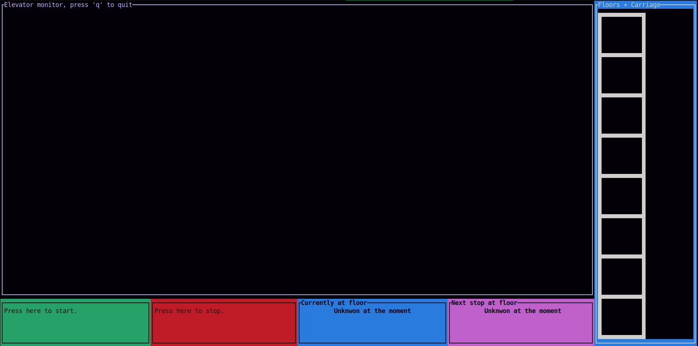
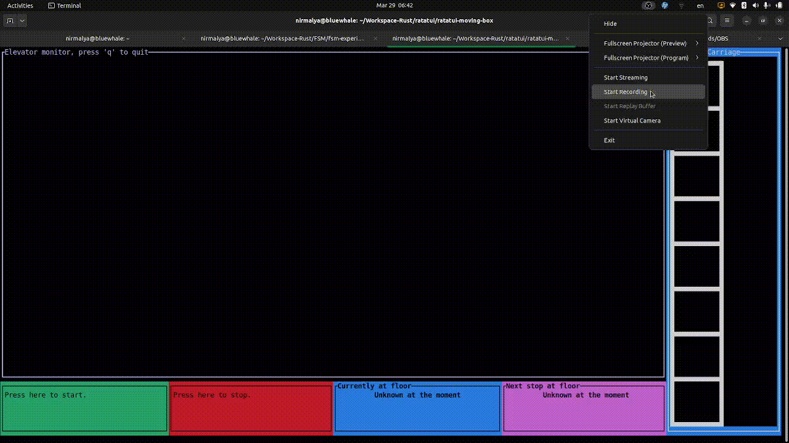

### An elevator, on-screen

This is a fun project, and primarily the result of my journey with Rust ( #rustlang ) in general and a few other design approaches and tools in particular, namely:

*   ratatui (https://ratatui.rs/)
*   ractor  (https://github.com/slawlor/ractor)
*   finite state machine (https://docs.rs/rust-fsm/latest/rust_fsm/)
*   (and of course) tokio (https://tokio.rs/)
   
### The objective

The objective is to simulate an working elevator, but on a usual text-based terminal like one is used to on a Linux machine. A building has several floors and an elevator. Once the elevator starts, a passenger can click on the 'I am waiting here' button at any floor. The elevator moves to that floor and lets the passengers exit and probably enter too. Then, the elevator moves to another floor based upon the button pressed. Then, it again lets the passengers exit and probably enter. This continues, till the elevator is stopped.

### The components

The application has four main components:

* The user-facing, terminal-based component: through this an operator starts and stops the elevator, and the passengers indicate the floors that they want the elevator to move to. The visible floors and simulated mobile carriage are also implemented in this component.
* The elevator and its pulley: these are modeled and implemented as __actors__ . Being actors, they specify their own vocabularies, a set of events that they publish, recognize and respond to.
* The finite-state-machine: the movement of the elevator is governed by this FSM. The states and transitions are pre-defined. Events reaching the elevator are submitted to this FSM and the resultant transitions, ensure that the behaviour of the elevator (and the pulley, as needed) are always **deterministic**  and therefore, verifiable.
* The application, called the 'App', which holds these components together, oversees their life-cycle and facilitates communication between them.

The widgets and APIs to use them effectively are provided by the fantastic #ratatui library.

### How to run

Note: I have tested this on my Lenovo Ideapad Slim 5 laptop, running Ubuntu 22.10, **only**. 

After checking out and building the application, provide the command at the shell prompt:

```shell
RUST_LOG=info cargo run
```
After a second or so (initializing) It says:

```shell
All set. Press any key to start.
```

On its first appearance, the application looks like this:



At this point in time, the floors are seen at the right-most block ( with title 'Floors+Carriage' ) but no carriage is seen. By pressing on the green box at the bottom row ( with prompt 'Press here to start' ), the operator can bring the carriage in operation.


The carriage can be seen at the right most corner, a green box, just beside the floors.

Clicking on any floor, will force the carriage to move to that floor, to wait for a moment (simulating the action of opening the door, letting the passengers alight and embarking), and then to close the door.

The elevator service is stopped, at any point in time, by pressing the red box at the bottom row.

Here's a small clip: 

During its run, the application generates sufficiently descriptive log ( `info` ) and stores these in a file named `elevator.log` in the current directory.

### Concurrent handling

A passenger on any floor may press the button, while

*   The carriage is standing at some other floor
*   The carriage is moving
*   The carriage has just reached a floor and passengers are still alighting

Moreover, the operator can decide to stop the elevator, when
*   S/he has sensed an emergency and pressed the **stop** button

When the operator 'stop's the elevator (the Red button at the bottom), tHe procedure adopted is to allow the carriage to complete the journey to a floor, if it is already moving. However, after this floor's passengers have safely alighted, the carriage moves back to ground floor, as a measure of safety ( hey, this is my elevator and I decide how it behaves :smile: ). I assume that the machinery has enough backup power to complete this locomotion.


The application handles these events, **deterministically** using a __FSM__ in association with an __Actor__. The mouse-clicks at the ui (task of #ratatui) are passed on as events to the Elevator actor. The outcome of FSM's transitions to the next state, is then translated to corresponding visual changes on the screen.

### TODO

Two major improvements, I would like bring about:
*   Convert the ui-functionality into an Actor itself, so that all communications between components happen by messages between the Actors.
*   Simulate the effect of opening and closing the elevator's door, by some 'fill' kind of effect. This requires a specialized widget, unless good folks at #ratatui come up with one such, easing the life for me!  😁
  
I also plan to write separate blogs and/or READMEs, to elaborate how the application is structured and why.  
  

### Acknowledgment

Along with many Rust experts whose books, blogs and tutorials are helping me to get a grip on #rustlang, I must make a special mention of the team at ractor (https://github.com/slawlor/ractor), Eugene Babichenko (https://github.com/eugene-babichenko), and **of course**, the fantastic team of #ratatui ().